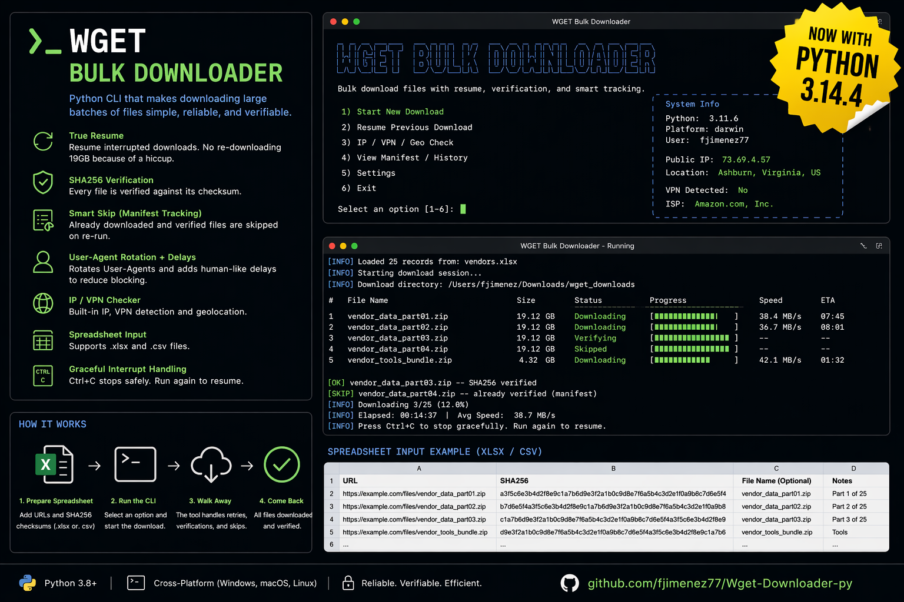

# WGET Bulk Downloader - Batch File Download Manager with Resume & Checksum Verification

A Python CLI bulk download manager with resume capability, SHA256 checksum verification, and privacy features. Built on `wget` for downloading large files (OVA images, firmware, ISO, virtual appliances) from pre-signed AWS S3 URLs, Azure Blob Storage, or any HTTP/HTTPS source. Supports batch downloading from spreadsheets (Excel `.xlsx`, `.csv`) with automatic retry, user-agent rotation, and VPN integration.

```
 ██╗    ██╗ ██████╗ ███████╗████████╗    ██████╗ ██╗
 ██║    ██║██╔════╝ ██╔════╝╚══██╔══╝    ██╔══██╗██║
 ██║ █╗ ██║██║  ███╗█████╗     ██║       ██║  ██║██║
 ██║███╗██║██║   ██║██╔══╝     ██║       ██║  ██║██║
 ╚███╔███╔╝╚██████╔╝███████╗   ██║       ██████╔╝███████╗
  ╚══╝╚══╝  ╚═════╝ ╚══════╝   ╚═╝       ╚═════╝ ╚══════╝
       Bulk Downloader  v2.0  |  Human-like & Resume-capable
```

---

## Why This Exists

You get a vendor email with 15 pre-signed S3 download links, each pointing to a multi-gigabyte OVA. You're supposed to `wget -O` each one manually, pray your connection holds, and hope the file isn't corrupt when it lands. If it drops at 90%, you start over.

**Not anymore.**

Drop your URLs into a spreadsheet, paste in the vendor's SHA256 checksums, fire up the script, and walk away. It downloads everything in sequence with human-like timing, resumes interrupted transfers automatically, verifies every file against its checksum, and tracks exactly what's done vs. what still needs pulling. If your VPN drops or your laptop sleeps mid-transfer, just re-run -- it picks up right where it left off and skips anything already verified.

---

## Core Capabilities

### Downloads & Resume
- **True resume support** -- interrupted downloads pick up from the exact byte via `wget -c`. No re-downloading 20 GB because your connection hiccuped at 19.8 GB.
- **Automatic retry** -- 3 retries per file with 60-second timeout on stalled connections.
- **Batch processing** -- reads URLs from `.xlsx`, `.csv`, or `.tsv` spreadsheets. One file, dozens of downloads.
- **Auto file discovery** -- scans your working directory for spreadsheets and lets you pick from a list. No typing paths.
- **Smart skip on re-run** -- completed + verified files are skipped instantly. Only failed or missing files get retried.

### Integrity & Verification
- **SHA256 checksum verification (optional)** -- paste the vendor's hash into the `sha256` column and the script verifies the file after download. Leave the column blank or omit it entirely if you don't have a checksum -- the file still downloads, verification is just skipped.
- **Download manifest** -- `download_manifest.json` persists in the output folder. Tracks status (`completed`, `failed`, `sha256_mismatch`), file sizes, timestamps, and attempt counts.
- **Corruption detection** -- if a file downloads but the checksum doesn't match, it's flagged immediately. No deploying a corrupt OVA into production.
- **Path traversal protection** -- filenames from spreadsheets are sanitized. No `../../etc/passwd` escaping the output folder.

### Privacy & OPSEC
- **User-Agent rotation** -- cycles through 6 real browser User-Agent strings (Chrome, Firefox, Safari on Windows/macOS/Linux). Server logs see a browser, not `Wget/1.25.0`.
- **Human-like timing** -- configurable random delays between downloads (default 4-15 seconds). Traffic pattern looks like a person clicking links, not a script hammering an endpoint.
- **Built-in IP checker** -- option [3] queries your public IP and runs geolocation. Shows country, city, ISP, ASN, and whether it's flagged as a datacenter/VPN IP. Know your exit node before you start.
- **VPN detection** -- automatically tells you if your current IP looks like a VPN/datacenter or a residential ISP. If it's residential, you get a warning before downloading.
- **VPN recommendations** -- built-in guide covering Mullvad, ProtonVPN, and IVPN with privacy comparisons, payment anonymity, and setup checklists.

### Operational
- **Graceful Ctrl+C** -- interrupt mid-download and the manifest saves, a summary prints, and you return to the menu cleanly. No tracebacks, no lost state.
- **Template generator** -- option [6] creates a blank `.csv` with the correct headers. Fill it in, run it, done.
- **Status dashboard** -- option [5] reads the manifest and prints a table: what completed, what failed, file sizes, timestamps, and whether the file still exists on disk.
- **Dependency bootstrap** -- first run auto-installs `requests`, `pandas`, and `openpyxl` if missing. Checks for `wget` on PATH. Zero manual setup.

---

## Menu

```
  [1]  Download from file          (.xlsx or .csv)
  [2]  Traffic obfuscation guide   (VPN info & tips)
  [3]  Check my current public IP
  [4]  Quick start & help
  [5]  View download status        (manifest report)
  [6]  Generate download template  (blank .csv)
  [0]  Exit
```

---

## Quick Start

```bash
# Clone
git clone https://github.com/fjimenez77/Wget-Downloader-py.git
cd Wget-Downloader-py

# Run
python3 wget_downloader.py
```

On first run, the script checks for dependencies and installs any missing packages automatically.

### Requirements

- **Python 3.7+**
- **wget** (`brew install wget` on macOS, `sudo apt install wget` on Linux)
- Python packages: `requests`, `pandas`, `openpyxl` (auto-installed on first run)

---

## Spreadsheet Format

Use option **[6]** to generate a blank template, or fill in the included `downloads_template.xlsx`.

| Column | Required | Description |
|--------|----------|-------------|
| `#` | no | Row number |
| `url` | **yes** | Full download URL (including any query params for pre-signed URLs) |
| `file` | no | Output filename (auto-detected from URL if blank) |
| `sha256` | no | SHA256 checksum for post-download verification (64 hex chars) |
| `notes` | no | Your comments (ignored by the downloader) |

> **Only `url` is required.** The script works fine without `sha256`, `file`, or `notes`. If you don't have a checksum from the vendor, leave the `sha256` cell blank (or omit the column entirely) -- the file downloads normally and verification is skipped. SHA256 is a recommended safety check, not a dependency.

### Example: Vendor Share Link to Spreadsheet

Your vendor gives you:

```
File:           firmware-v2.1.ova
SHA256:         c1cfa83b7539202b9ac91e6e7cb1fff9005b23c97b1e25d98a1a6d0c38644f2a
Link:           wget -O firmware-v2.1.ova "https://vendor.s3.amazonaws.com/firmware-v2.1.ova?AWSAccessKeyId=..."
```

Map it to the CSV:

```csv
#,url,file,sha256,notes
1,https://vendor.s3.amazonaws.com/firmware-v2.1.ova?AWSAccessKeyId=...,firmware-v2.1.ova,c1cfa83b7539202b9ac91e6e7cb1fff9005b23c97b1e25d98a1a6d0c38644f2a,
```

---

## At a Glance



---

## How It Works

### Download Flow

```
Spreadsheet (.xlsx/.csv)
    │
    ▼
┌─────────────────────────────────┐
│  Load URLs + filenames + SHA256 │
│  Load manifest (skip completed) │
└─────────────┬───────────────────┘
              │
              ▼
┌─────────────────────────────────┐
│  For each file:                 │
│    ├─ Already verified? → SKIP  │
│    ├─ wget -c (resume partial)  │
│    ├─ SHA256 verify (optional)  │
│    ├─ Update manifest           │
│    └─ Human-like pause          │
└─────────────┬───────────────────┘
              │
              ▼
┌─────────────────────────────────┐
│  Summary: OK / FAIL / SKIP     │
│  Manifest saved to disk        │
└─────────────────────────────────┘
```

### Resume Across Runs

1. First run: downloads file, verifies SHA256, marks `completed` in manifest
2. Connection drops mid-file: partial file stays on disk, manifest shows `failed`
3. Re-run: completed files skip instantly, partial files resume from last byte
4. All files done: manifest shows everything `completed + SHA256 verified`

### IP Check & VPN Verification

```
  ➤  207.244.109.241

  LOCATION & NETWORK
  ────────────────────────────────────────────────────────────
    Country : United States
    Region  : Virginia
    City    : Manassas
    ISP     : Leaseweb USA
    Org     : Proxima Consulting
    ASN     : AS30633 Leaseweb USA, Inc.
    Flags   : datacenter/hosting, proxy/VPN detected
  ────────────────────────────────────────────────────────────

  ✓  This looks like a VPN / datacenter IP — good.
```

### Status Dashboard

```
  ✓  📁  firmware-v2.1.ova                    21.3 GB  2026-04-15T12:30
  ✓  📁  OS-1.8.17.ova                        33.0 GB  2026-04-15T13:05
  ✗  ⚠️   OS-1.8.12.ova                        31.2 GB  SHA256 mismatch
  ✗      toolbox-setup.sh                       0.0 B  Never downloaded
  ────────────────────────────────────────────────────────────
  Total: 2 completed (54.3 GB), 2 failed, 0 other
```

---

## Output Structure

```
downloads/
  download_manifest.json          # completion + verification tracking
  firmware-v2.1/
    firmware-v2.1.ova             # downloaded & verified
  toolbox-setup/
    toolbox-setup.sh              # downloaded & verified
```

---

## Use Cases

- **IT / Infrastructure teams** pulling OVA/OVF virtual machine images from vendor portals
- **Security teams** staging firmware and patch files with integrity verification before deployment
- **Ops engineers** batch-downloading from pre-signed AWS S3 or GovCloud URLs
- **Air-gapped environments** where files need to be staged and checksummed before transfer
- **Anyone** tired of babysitting multi-gigabyte downloads over flaky VPN connections
- **Compliance workflows** requiring proof of file integrity via SHA256 verification logs

---

## Keywords

`wget bulk download`, `batch file downloader`, `resume download python`, `sha256 file verification`, `pre-signed S3 URL downloader`, `OVA download tool`, `firmware bulk download`, `download manager CLI`, `wget automation`, `checksum verification tool`, `VPN download tool`, `spreadsheet batch download`, `large file downloader`, `wget resume interrupted download`, `Python download script`

## Contributing

Pull requests, bug reports, and feature suggestions are welcome. See **[CONTRIBUTING.md](CONTRIBUTING.md)** for full guidelines.

**Quick version:**

```bash
# 1. Fork the repo on GitHub
# 2. Clone your fork
git clone https://github.com/YOUR_USERNAME/Wget-Downloader-py.git
cd Wget-Downloader-py

# 3. Create a feature branch
git checkout -b feature/your-idea

# 4. Make changes, test locally
python3 wget_downloader.py
python3 -m py_compile wget_downloader.py

# 5. Commit + push + open a PR
git commit -m "Add: your change"
git push origin feature/your-idea
```

**Before opening a PR:**
- Open an issue first for non-trivial changes
- Keep PRs focused (one logical change per PR)
- Test the affected functionality manually
- No new external dependencies without discussion
- No real URLs, AWS keys, or vendor data in commits

**Reporting bugs?** Include OS, Python version, `wget --version`, and reproduction steps.

**Found a security issue?** Don't open a public issue — use [GitHub Security Advisories](https://github.com/fjimenez77/Wget-Downloader-py/security/advisories/new) instead.

## Contributors

- [@fjimenez77](https://github.com/fjimenez77) (Felix J.)
- [@netsecops-76](https://github.com/netsecops-76) (Brian Canaday)
- [@DevForgeAtlas](https://github.com/DevForgeAtlas)

## License

Apache License 2.0 — see [LICENSE](LICENSE) for full text.

```
Copyright 2026 Felix J. (@fjimenez77) and contributors

Licensed under the Apache License, Version 2.0 (the "License");
you may not use this file except in compliance with the License.
You may obtain a copy of the License at

    http://www.apache.org/licenses/LICENSE-2.0
```
